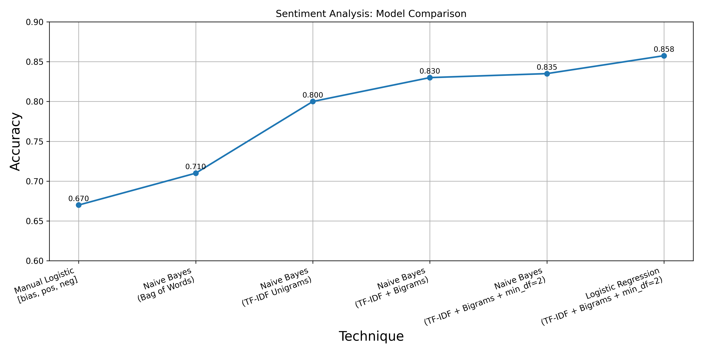

# RESULTS.md

## 🎯 **Movie Reviews Sentiment Analysis: Model Comparison**

This summary shows how accuracy improved step-by-step as the text pipeline evolved:

| Technique | Accuracy |
|----------------|-----------|
| Manual Logistic [bias, pos, neg] | ~67% |
| Naive Bayes (Bag of Words) | ~71% |
| Naive Bayes (TF-IDF Unigrams) | ~80% |
| Naive Bayes (TF-IDF + Bigrams) | ~83% |
| Naive Bayes (TF-IDF + Bigrams + min_df=2) | ~83.5% |
| Logistic Regression (TF-IDF + Bigrams + min_df=2) | **~85.75%** |

## ✅ **Key insight:**
Adding richer text features (TF-IDF, bigrams) and a stronger model (Logistic Regression) steadily boosted performance from a basic ~67% to a solid ~86%.

Below is the final results plot:

## 📌 **Next steps:**
- Try hyperparameter tuning (GridSearchCV)
- Try BERT/Transformers for context-aware embeddings
- Deploy as an API or integrate in a live sentiment tool

**This file summarizes the full experiment.** 🚀
